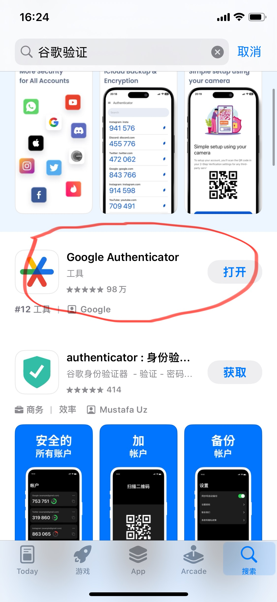

# 币安注册

**重点：币安注册这一步不难，真正重要的是把“注册 + 实名 + 二次验证”三件事都做完整。**

如果你准备开始接触数字资产，交易所注册通常是第一步。

对新手来说，注册币安时可以先把目标压得很简单：

> **完成账户注册、完成身份认证、完成安全设置。**

这三步缺一不可。

## 一、注册要完成的 3 个动作

### 1. 注册账户
注册地址：  
https://www.binance.com/zh-CN/register

先完成最基础的账户创建。

### 2. 完成身份认证
教程：  
https://www.binance.com/zh-CN/support/faq/detail/360027287111

身份认证完成后，后续很多基础功能才更容易正常使用。

### 3. 启用谷歌验证器
教程：  
https://www.binance.com/zh-CN/support/faq/detail/115000433432

这一步非常重要。它不是可有可无，而是账户安全的基础动作之一。

在 App Store 搜索"谷歌验证"，下载第一个结果（Google Authenticator，由 Google 出品）：

## 二、注册时最重要的注意事项

### 1. 注册密码不要和其他平台重复
这是最基本的一条。

### 2. 如果用邮箱注册，优先用自己长期稳定的邮箱
不要随便用一个你自己都不常登录的邮箱。

### 3. 谷歌验证器一定要开
不要因为嫌麻烦就跳过。对涉及资产的平台来说，二次验证非常重要。

如果你还没有长期常用的邮箱，可以先准备一个稳定、自己会长期登录的 Gmail 邮箱。

## 三、完成标准

完成这篇后，你至少应该做到：
- 有一个能正常登录的币安账户
- 身份认证已完成
- 二次验证已开启
- 恢复信息已保存好

如果这几件事都做完，说明你已经完成了进入下一步的准备。

## 四、下一步看什么？

- 如果你还想多一个备用入口，去看《易欧注册》
- 如果你已经注册完成，下一步可以看《新手如何完成第一笔 BTC ETH 买入》

## 一句话总结

**币安注册真正的完成标准，不是“我注册了”，而是“我已经把账户和安全设置都做完整了”。**
