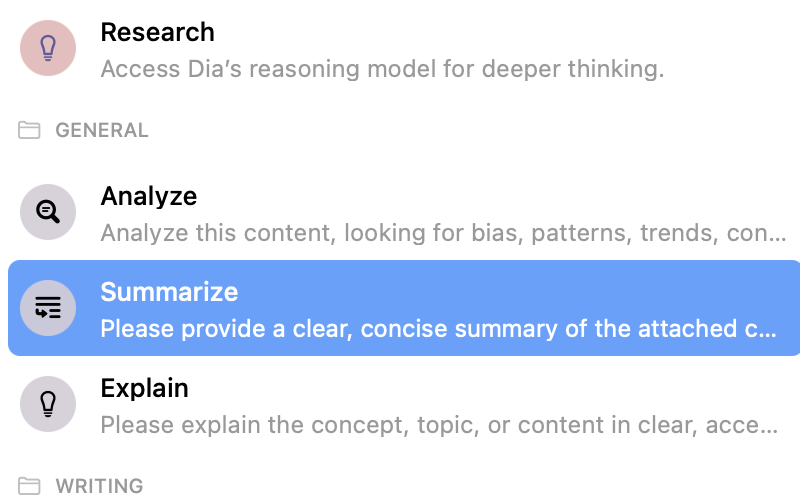

# AI工具

**重点：AI 工具最适合承担“提高信息处理效率”的工作，而不是替你做最终判断。**

如果你已经在接触 Web3、文章、推文和英文信息源，AI 工具的主要价值是：

> **帮你更快看懂、整理和分析内容。**

## 一、先讲稳定原则：AI 适合做什么？

对普通用户来说，AI 最有价值的场景通常是：

- 翻译英文内容
- 总结长文、白皮书
- 解释陌生概念（比如什么是 Layer2、什么是质押）
- 帮你快速抓重点
- 辅助初步分析一条信息值不值得深入研究

## 二、再讲边界：AI 不适合替你做什么？

AI 很适合帮你提升效率，但不适合替你承担最终判断。

尤其是涉及：
- 投资决策
- 风险判断
- 资金操作

把 AI 当成助手和整理器，而不是“我把脑子交给它”。

## 三、当前推荐：Dia 浏览器

在当前这套工具组合里，Dia 是比较适合做信息分析的 AI 浏览器，尤其适合 Web3 信息获取场景。

它的核心优势是：看任何网页时，直接在侧边唤出 AI 进行分析，不需要复制粘贴。

**下载地址：** https://www.diabrowser.com/

### 内置常用操作

打开一篇推文、文章或页面后，点击 Dia 的 AI 面板，可以直接使用：

- **Analyze** — 分析内容偏见、逻辑和可信度
- **Summarize** — 提取核心要点
- **Explain** — 解释陌生概念
- **Research** — 调用推理模型深度研究

### 实际使用场景

在刷推文时看到一条 Web3 项目信息，直接点击 Analyze，Dia 会自动判断作者背景、内容立场和潜在偏见：

## 四、最实用的使用方式

你可以优先把 AI 用在这些地方：

- 读英文文章前先抓重点
- 看推文线程时先快速总结
- 碰到陌生概念先让它解释
- 对一段内容做初步结构化整理

## 五、看完这篇，下一步做什么？

- 如果你想先搭好浏览环境，下一篇看《工具》
- 如果你已经开始刷 X / 读文章，就直接先把一个 AI 工具用起来

## 一句话总结

**AI 工具最值得承担的是信息处理效率，而不是替你做最终判断；Dia 只是当前比较顺手的一个实现。**
