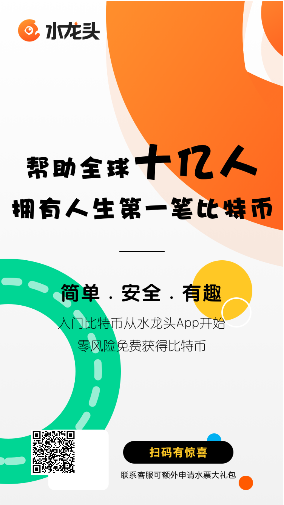
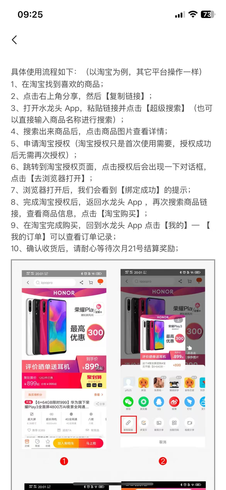
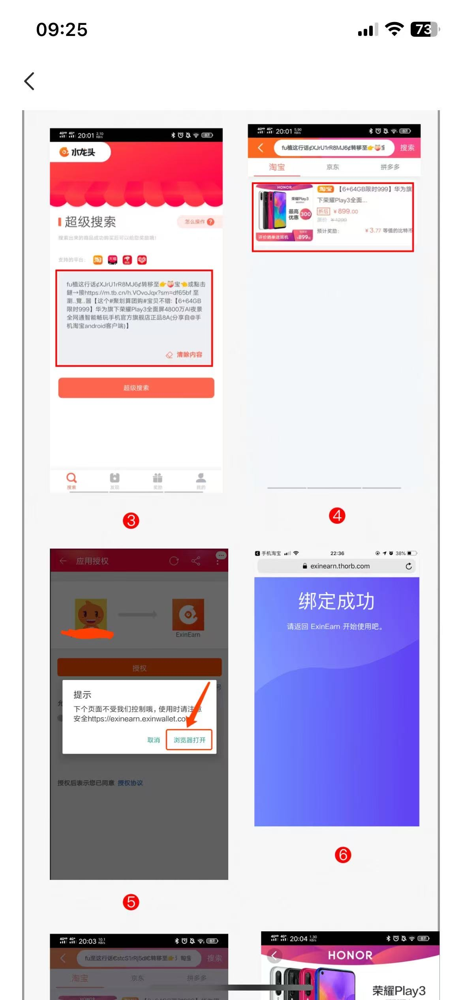
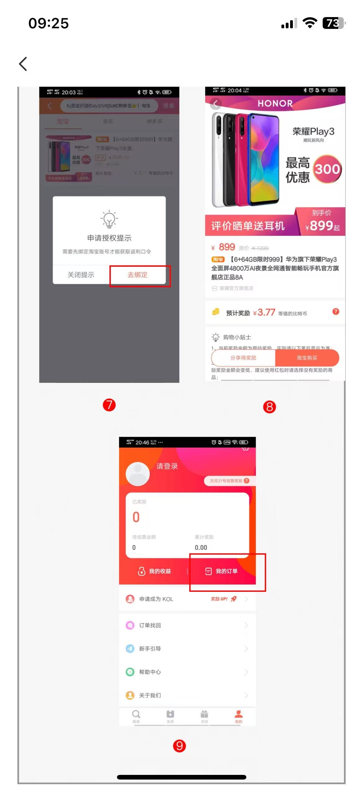
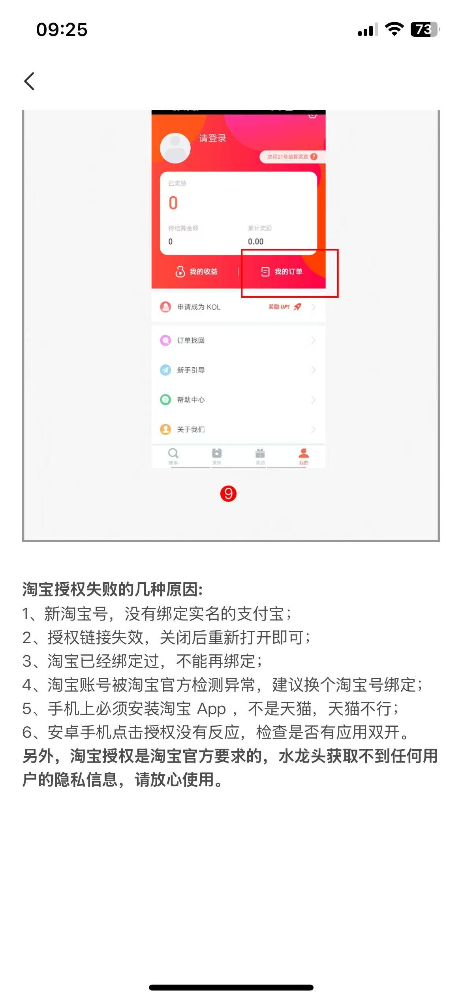

# 水龙头 APP

**重点：水龙头是一个通过日常网购就能获得 BTC 返利的工具。在淘宝、京东、天猫、拼多多正常购物，部分订单会以 BTC 形式返还一小部分奖励。**

它不需要你额外花钱，也不需要改变购物习惯。本质是把你本来就会花的消费，附带积累一点 BTC。

> **版本提示：本文基于当前产品界面和流程整理；如果后续页面改版，请以官方实际页面为准。**

## 一、怎么找到它

水龙头是 **Mixin** 里的一个机器人，Mixin ID：**7000000014**

使用前需要先下载 Mixin 并注册账户。

扫码直达：

## 二、使用流程（以淘宝为例）

其他平台（京东、天猫、拼多多）操作方式相同。

### 第一步：在淘宝找到商品，复制链接

在淘宝找到想买的商品 → 点击右上角分享 → 选择【复制链接】

### 第二步：打开水龙头，搜索商品

打开水龙头 App → 粘贴链接到搜索框 → 点击【超级搜索】

搜索结果会显示该商品预计能获得的 BTC 奖励金额。

### 第三步：首次使用需要绑定淘宝账号

第一次使用时，系统会提示需要绑定淘宝授权：

点击【去绑定】→ 弹出提示后点击【浏览器打开】→ 看到【绑定成功】即完成

绑定完成后，后续使用无需再次授权。

### 第四步：完成购买，等待结算

绑定完成后，在水龙头搜索商品 → 点击商品 → 查看 BTC 奖励预估 → 点击【淘宝购买】完成下单

购买后可以在【我的】→【我的订单】查看订单状态。

**奖励在确认收货后，每月 21 号统一结算。**

## 三、淘宝授权失败常见原因

如果在绑定淘宝时出现问题，通常是以下几种原因：

1. 新淘宝号没有绑定实名支付宝
2. 授权链接失效 — 关闭后重新打开再试
3. 该淘宝号之前已经绑定过，不能重复绑定
4. 淘宝账号被平台检测异常 — 建议换一个账号绑定
5. 手机上没有安装淘宝 App（注意：天猫 App 不行，必须是淘宝）
6. 安卓手机点击无反应 — 检查是否开启了应用双开

> 淘宝授权是淘宝官方要求的标准流程，水龙头不会获取你的任何隐私信息。

## 四、这个方式适合谁？

- 已经完成基础注册和买入路径的人
- 本来就经常网购的人
- 想用日常消费慢慢积累 BTC 的人

## 五、不适合用来做什么？

- 不能替代正常买入路径
- 不适合期待高收益或短期翻倍
- 不是“零成本快速获利”的方式

## 六、看完这篇，下一步做什么？

- 如果你还没完成基础路径，先回到交易所注册和第一笔买入
- 如果你已经有基础账户体系，这篇可以作为日常补充玩法

## 一句话总结

**水龙头的价值不是让你快速赚钱，而是把日常购物顺带转化成少量 BTC 积累。**
